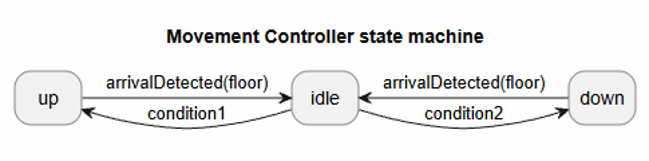
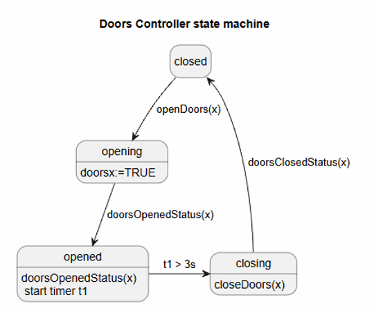
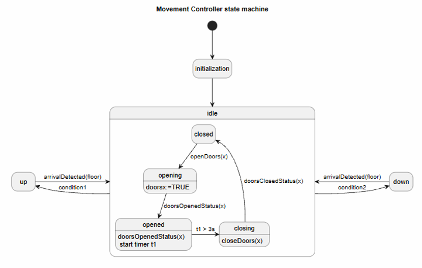
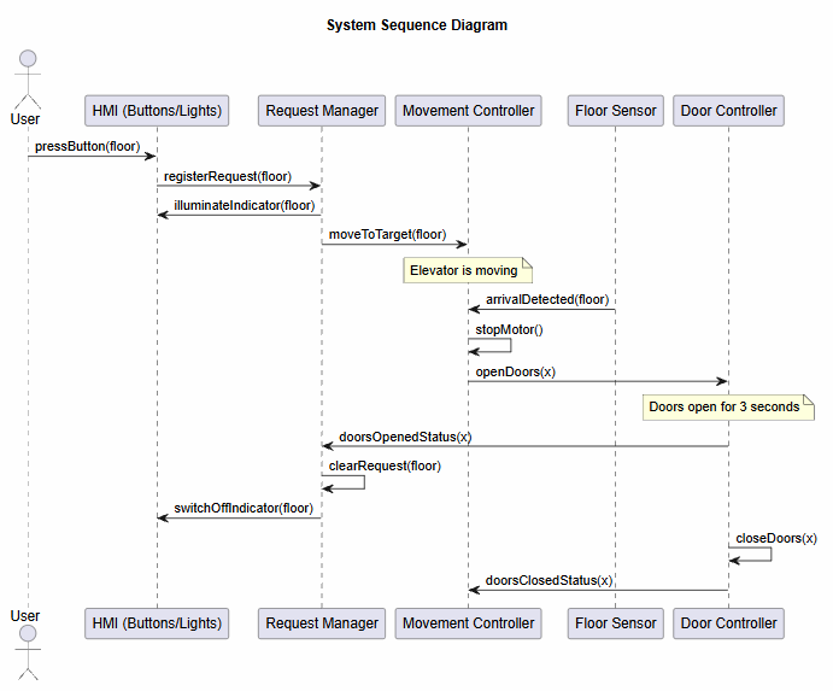
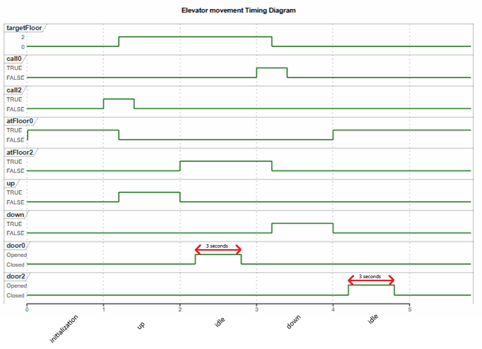

# Requirements of an elevator system:

### A Transportation
- **RTA-01** | WHEN all doors are closed and a request exists, the Elevator Controller shall move the elevator towards the requested floor.
- **RTA-02** | WHEN the destination floor sensor becomes active, the Elevator Controller shall stop the elevator.

### B Request Handling
- **RRH-01** | WHEN a cabin or floor button is pressed, the Elevator Controller shall register the requested floor.
- **RRH-02** | IF a button is pressed for a floor that is already registered, THEN the Elevator Controller shall ignore the duplicate request.
- **RRH-03** | WHEN the elevator doors open at a requested floor, the Elevator Controller shall clear the corresponding request.
- **RRH-04** | WHILE multiple requests are registered, the Elevator Controller shall service them in the order they were received.

### C Door Operation
- **RDO-01** | WHEN the elevator stops at a requested floor, the Elevator Controller shall open the doors.
- **RDO-02** | WHEN the elevator door has opened, the Elevator Controller shall keep the door open for 3 seconds.
- **RDO-03** | WHEN the 3-second door open time has elapsed, the Elevator Controller shall close the doors.

### D Safe Operation
- **RSO-01** | WHILE any elevator door is open, the Elevator Controller shall not command elevator movement.

### E Operator Feedback
- **ROF-01** | WHEN a floor or cabin request is accepted, the Elevator Controller shall illuminate the corresponding request indicator.
- **ROF-02** | WHILE a request is pending, the Elevator Controller shall maintain the corresponding indicator illuminated.
- **ROF-03** | WHEN a request is cleared by the controller, the Elevator Controller shall switch off the corresponding request indicator.

### F Contoller initialization
- **RCI-01** | WHEN the controller is initialised, the Elevator Controller shall clear all stored requests.
- **RCI-02** | WHEN the controller is initialised, the Elevator Controller shall switch off all request indicators.
- **RCI-03** | WHEN the controller is initialised, the Elevator Controller shall command the elevator to move to Floor 0.

---

# Logical design of an elevator system

### State machine of a Movement Controller:
The transitions within the Movement Controller state diagram are governed by specific events and guard conditions. To maintain diagram readability, these complex transition conditions have been abstracted as follows:
- **condition1**: moveToTarget(floor) AND [allDoorsClosed AND (queuedFloor > currentFloor)]
- **condition2**: moveToTarget(floor) AND [allDoorsClosed AND (queuedFloor < currentFloor)]

### State machine of a Door Controller:

### Final version of combined state diagrams:

### Seqence diagram:

### Explanation of used functions:
- **pressButton(floor)**: A signal generated when the User presses a cabin or floor button on the HMI to call the elevator.
- **registerRequest(floor)**: A message sent from the HMI to the Request Manager to store the requested floor in the system's queue.
- **illuminateIndicator(floor)**: A command sent by the Request Manager to the HMI to light up the corresponding button, providing visual feedback that the request was accepted.
- **moveToTarget(floor)**: A command issued by the Request Manager to the Movement Controller to initiate the elevator's travel towards the destination floor.
- **arrivalDetected(floor)**: A hardware signal from the Floor Sensor informing the Movement Controller that the elevator has physically reached the target floor.
- **stopMotor()**: An internal action executed by the Movement Controller to halt the elevator cabin upon arrival.
- **openDoors(x)**: A command instructing the Door Controller to begin the opening sequence for the doors at the current floor.
- **doorsOpenedStatus(x)**: A feedback status confirming the doors are fully open. This triggers the 3-second timer in the Doors Controller and prompts the Request Manager to clear the request.
- **clearRequest(floor)**: An internal action where the Request Manager removes the currently serviced floor from its pending requests queue.
- **switchOffIndicator(floor)**: A command sent to the HMI to extinguish the button's light, signaling that the request has been fully serviced.
- **closeDoors(x)**: An action executed by the Door Controller to shut the doors once the 3-second open interval has elapsed.
- **doorsClosedStatus(x)**: A critical safety feedback signal indicating the doors are fully secured, which satisfies the allDoorsClosed guard condition and allows the elevator to move again.

### Timing diagram representing elevator movement:

The timing diagram illustrates four distinct operational phases for the cabin movement controller: initialization, idle, (moving) up, and (moving) down. While the diagram explicitly demonstrates the sequence of events for Floor 0 and Floor 2, the represented logical behaviour remains identical across all three floors.

---

# Requirement Coverage Table

| Requirement ID | Requirement Category | Coverage in logical design |
| :--- | :--- | :--- |
| **RTA-01** | Move towards the requested floor when doors are closed. | State Diagram (Movement): Transitions from idle to up/down with the allDoorsClosed guard condition. |
| **RTA-02** | Stop when the destination floor sensor becomes active. | State Diagram (Movement): Transitions from up/down to idle with the arrivalDetected(floor) guard condition. |
| **RRH-01** | Register requested floor when button is pressed. | Seq Diagram: registerRequest(floor) function. |
| **RRH-02** | Ignore duplicate requests. | Guaranteed by the Request Manager logic, which only accepts new integers into the queue if they do not already exist. |
| **RRH-03** | Clear request when doors open at requested floor. | Seq Diagram: Action clearRequest(floor) called after doors open (doorsOpenedStatus(x)). |
| **RRH-04** | Service multiple requests in order. | Logic implies queue handling within the Request Manager object. |
| **RDO-01** | Open doors when stopped at a requested floor. | Nested State Diagram: Transition to the door machine (inside idle) and action openDoors(x). Timing Diagram: Demonstrates the door state changing to 'Opened' upon elevator arrival. |
| **RDO-02** | Keep doors open for 3 seconds. | State Diagram (Doors): Timer activation in the opened state (start timer t1). Timing Diagram: Explicitly visualizes the mandatory 3-second interval during which the doors remain in the 'Opened' state. |
| **RDO-03** | Close doors when 3 seconds elapse. | State Diagram (Doors): Transition from opened to closing with the guard condition t1 > 3s. Timing Diagram: Illustrates the door state changing to 'Closed' precisely after the 3-second interval elapses. |
| **RSO-01** | Do not move while any door is open. | Nested State Diagram: Impossible to leave the idle state until the doors report the doorsClosedStatus(x) condition. |
| **ROF-01** | Illuminate indicator when request is accepted. | Seq Diagram: RM -> HMI: illuminateIndicator(floor). |
| **ROF-02** | Maintain illuminated indicator while pending. | Reflected by the absence of an indicator-off message during the movement phase in the seq diagram. |
| **ROF-03** | Switch off indicator when request is cleared. | Seq Diagram: RM -> HMI: switchOffIndicator(floor) after the request is cleared. |
| **RCI-01, RCI-02, RCI-03** | Initialization: clear, switch off, move to Floor 0. | Timing Diagram: Visible initialization phase where targetFloor is set to 0, among other signals. |