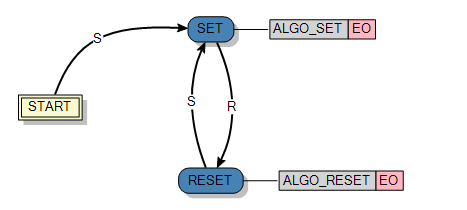
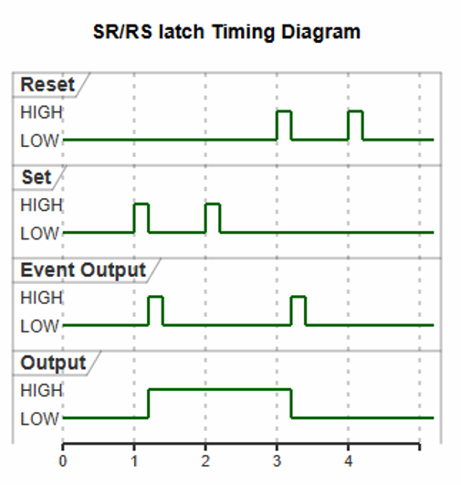
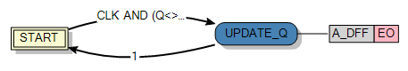
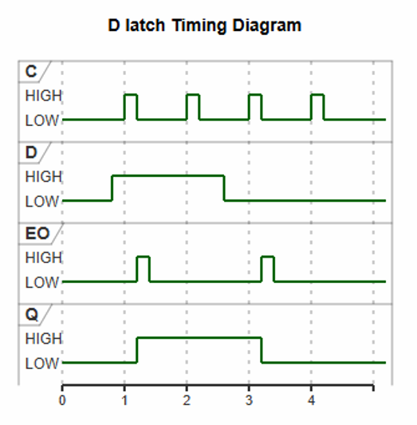
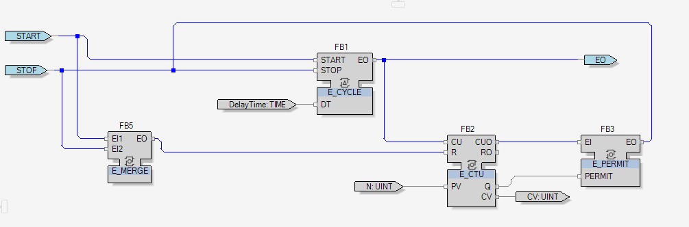
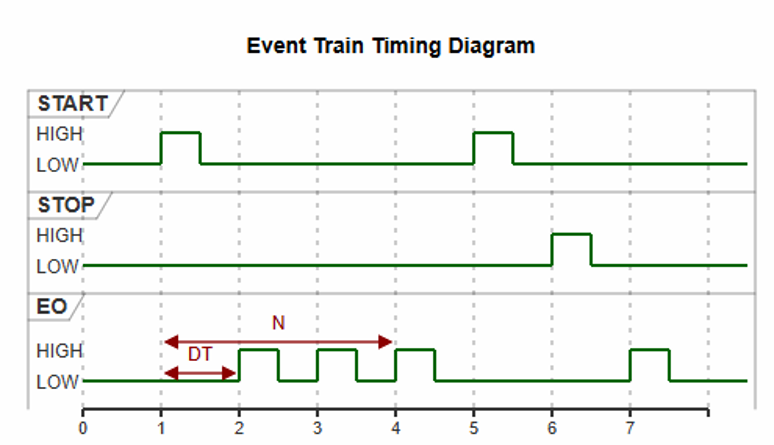
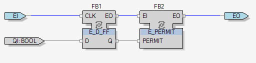
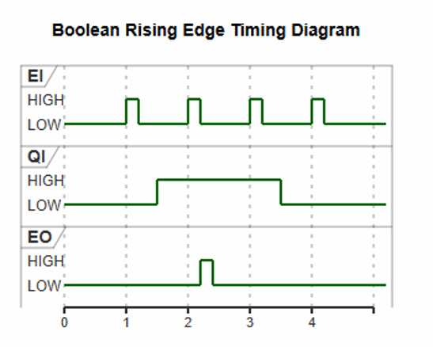

# Design Assignment 1 - Software Design for Industrial Automation (EN)

This project involves the implementation and testing of basic and composite Function Blocks in the EcoStruxure Automation Expert environment by Schneider Electric. The solutions are based on the IEC 61499 standard for PLC programming.

**Author:** ~MP

## Implemented Function Blocks

### Basic Function Blocks

*   **`RS Latch` (and `SR Latch`)**  
    A latch block where the Set (S) event sets the output to `true`, and the Reset (R) event changes it to `false`. The output event is triggered only when the output state changes.

   
  <i>Internal structure (ECC)</i>

   
  <i>Timing diagram</i>

*   **`D Flip-Flop`**  
    A D-type flip-flop block. The algorithm checks the state of the `D` variable when the clock event (CLK) is triggered. The transition condition to update the output `Q` requires a difference between the input and output values: **`CLK AND (Q <> D)`**.

   
  <i>Internal structure (ECC)</i>

   
  <i>Timing diagram</i>

### Composite Function Blocks

*   **`Event Train` (`E_TRAIN`)**  
    Generates a specific sequence of output events after the START event is triggered. The delay between events is defined by the delay time input, and the total number of events is defined by the variable `N`.

   
  <i>Internal structure (FBN)</i>

   
  <i>Timing diagram</i>

*   **`Event Rising Trigger` (`E_R_TRIG`)**  
    Detects a state change of the input variable from `false` to `true`. An output event is generated exclusively on a rising edge.

   
  <i>Internal structure (FBN)</i>

   
  <i>Timing diagram</i>

## Testing Methodology

A dedicated test application was created for each implemented block. Their behavior was directly compared to the official, built-in blocks from the software library. The tests confirmed that the created blocks behave identically to their reference counterparts.

## Conclusions & Known Issues

*   **Restricted Variable Names:** While designing the `E_TRAIN` block, the time variable had to be renamed from the default `DT` to `DelayTime` due to environment constraints.
*   **Documentation Discrepancy:** A behavioral difference was noted in the `E_TRAIN` block compared to the assignment schematics. In practice, the STOP event must be triggered before the START event for the sequence to properly begin.
*   **Architecture Modularity:** The IEC 61499-based environment offers a significant advantage by separating algorithm logic from the target hardware platform (Distributed Systems), allowing the full structure to be designed before coupling it with physical controllers.

---

# Zadanie Projektowe 1 - Software Design dla Rozproszonych systemów automatyki przemysłowej (PL)

Projekt polega na implementacji i przetestowaniu podstawowych oraz złożonych bloków funkcyjnych w środowisku EcoStruxure Automation Expert firmy Schneider Electric. Rozwiązania opierają się na standardzie IEC 61499 dla sterowników PLC.

**Autor:** ~MP

## Zaimplementowane Bloki Funkcyjne

### Podstawowe Bloki Funkcyjne (Basic Function Blocks)

*   **`RS Latch` (oraz `SR Latch`)**  
    Blok przerzutnika, w którym zdarzenie Set (S) ustawia wyjście na `true`, a zdarzenie Reset (R) zmienia je na `false`. Zdarzenie wyjściowe jest wyzwalane tylko przy zmianie stanu.

   
  <i>Wewnętrzna struktura (ECC)</i>

   
  <i>Diagram czasowy</i>

*   **`D Flip-Flop`**  
    Blok przerzutnika typu D. Algorytm sprawdza stan zmiennej `D` w momencie wyzwolenia zdarzenia zegara (CLK). Warunkiem przejścia i aktualizacji wyjścia `Q` jest wystąpienie różnicy między wartością wejściową a wyjściową: **`CLK AND (Q <> D)`**. Zdarzenie wyjściowe jest aktywowane w momencie zmiany stanu zmiennej wyjściowej.

   
  <i>Wewnętrzna struktura (ECC)</i>

   
  <i>Diagram czasowy</i>

### Złożone Bloki Funkcyjne (Composite Function Blocks)

*   **`Event Train` (`E_TRAIN`)**  
    Generuje określoną sekwencję zdarzeń wyjściowych po wyzwoleniu zdarzenia START. Opóźnienie między zdarzeniami określa wejście DelayTime, a liczbę wygenerowanych zdarzeń definiuje zmienna `N`.

   
  <i>Wewnętrzna struktura sieci bloków (FBN)</i>

   
  <i>Diagram czasowy</i>

*   **`Event Rising Trigger` (`E_R_TRIG`)**  
    Wykrywa zmianę stanu wejścia z `false` na `true`. Zdarzenie wyjściowe generowane jest wyłącznie przy zboczu narastającym.

   
  <i>Wewnętrzna struktura sieci bloków (FBN)</i>

   
  <i>Diagram czasowy</i>

## Metodologia Testowania

Dla każdego zaimplementowanego bloku stworzono dedykowaną aplikację testową. Ich zachowanie zostało bezpośrednio porównane z oficjalnymi blokami wbudowanymi w bibliotekę oprogramowania. Testy potwierdziły, że przygotowane bloki zachowują się identycznie jak ich odpowiedniki.

## Wnioski i Znane Problemy (Known Issues)

*   **Zastrzeżone nazwy zmiennych:** Podczas projektowania bloku `E_TRAIN` konieczna była zmiana nazwy zmiennej czasowej z domyślnego `DT` na `DelayTime`, z uwagi na restrykcje środowiska.
*   **Rozbieżności z dokumentacją:** Zauważono różnicę w działaniu bloku `E_TRAIN` względem schematów z zadania. W praktyce konieczne jest wyzwolenie zdarzenia STOP przed zdarzeniem START, aby sekwencja mogła się rozpocząć.
*   **Modułowość architektury:** Środowisko oparte na normie IEC 61499 oferuje znaczną przewagę poprzez oddzielenie logiki algorytmów od docelowej platformy sprzętowej (Distributed Systems), pozwalając na pełne zaprojektowanie struktury przed połączeniem z fizycznymi kontrolerami.
