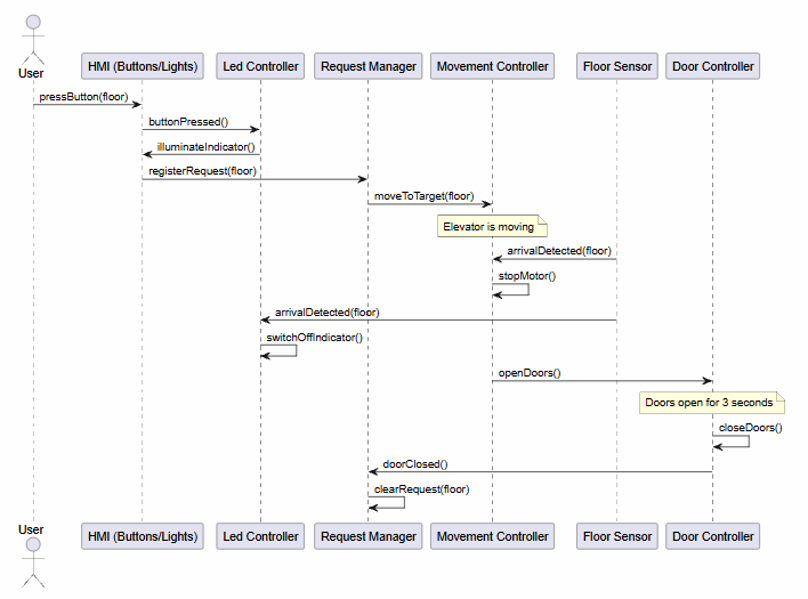

# 1. Requirements of an elevator system:

### A Luggage handling
* **RA-01** | WHEN there is a luggage present at lift and both cylinders are retracted, the Controller shall command to extend the vertical cylinder. 
* **RA-02** | WHEN the vertical cylinder is extended and luggage is lifted, the Controller shall command horizontal cylinder to extend.
* **RA-03** | WHEN the horizontal cylinder is extended, the Controller should command lift cylinder to retract.

### B Contoller initialization
* **RB-01** | WHEN the controller is initialised, the Controller shall command both cylinders to retract.

### C Safety
* **RC-01** | IF the presence of luggage is not detected, or both cylinders are not fully retracted, the Controller cannot start the cycle.
 
# 2. Logical design of an elevator system

**Sequence diagram:**

 

**Explanation of used functions:**
* **LuggageArrived**: A signal generated when the luggage arrives on the lift cylinder.
* **LIFT_EXTEND**: An event sent from master controller to lift controller to extend cylinder.
* **ExtendLift**: A information from the lift controller to model, that cylinder should be extended.
* **LiftExtended**: A confirmation from model to the lift controller, that lift cylinder is fully extended.
* **LiftExtendedCNF**: Confirmation from the lift controller to master controller, that lift cylinder is extended.
* **PUSHER_EXTEND**: An event sent from master controller to push controller to extend cylinder.
* **ExtendPusher**: A information from the push controller to model, that cylinder should be extended.
* **PusherExtended**: A confirmation from model to the pusher controller, that push cylinder is fully extended.
* **PusherExtendedCNF**: Confirmation from the pusher controller to master controller, that lift cylinder is extended.
* **LIFT_RETRACT**: An event sent from master controller to lift controller to retract the cylinder.
* **NOT PusherExtend** (value of variable is FALSE): An information from the pusher controller to model, that the cylinder should be retracting.
* **LiftRetract**: An information from the lift controller to model, that the cylinder should be retracting.
* **LiftRetracted**: A confirmation from model to the lift controller, that lift cylinder is fully retracted.
* **PushRetracted**: A confirmation from model to the pusher controller, that push cylinder is fully retracted.
* **LiftRetractedCNF**: Confirmation from the lift controller to master controller, that lift cylinder is retracted.
* **PusherRetractedCNF**: Confirmation from the pusher controller to master controller, that lift cylinder is retracted.

The implementation of Master-Slave architecture was firstly tested without setting up OPCUA server and clients. After successful tests, the OPCUA architecture functionality was added.
 
# 3. Requirement Coverage Table

| Requirement ID | Design Element | Requirement Description |
| :--- | :--- | :--- |
| **RA-01** | Master → Vertical cylinder controller | Extend lift cylinder, when there is a luggage present. |
| **RA-02** | Master → Horizontal cylinder controller | Extend push cylinder, when lift cylinder is extended. |
| **RA-03** | Master → Vertical cylinder controller Master → Horizontal cylinder controller | Retract both cylinders, when push cylinder is fully extended. |
| **RB-01** | Master → Vertical cylinder controller Master → Horizontal cylinder controller | Retract both cylinders, at startup of the Contoller. |
| **RC-01** | Master | Do not start operation until both cylinders are retracted and there is luggage present at lift cylinder |
